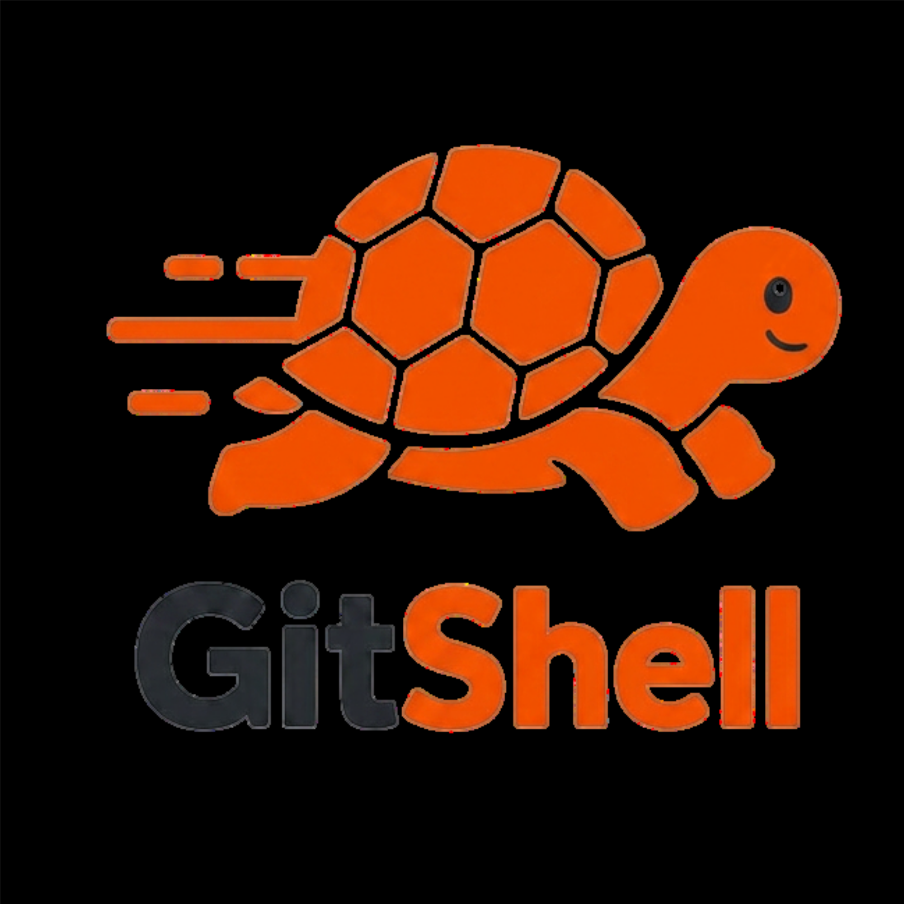

# DocsHound

<p align="center">
  
</p>

DocsHound turns open issues and merged pull requests into grounded,
reviewable documentation updates.

Give it a public repository and it will:

1. Collect recent issues and merged pull requests independently.
2. Separate unresolved documentation gaps from shipped changes.
3. Draft Markdown using the linked repository evidence.
4. Let a human edit and approve the document.
5. Detect the target documentation layout and prepare Markdown or MDX.
6. Preview the exact repository patch.
7. Create a documentation branch, commit, and pull request when write access is connected.

## Product flow

```text
Repository activity
        ↓
Open gaps + shipped changes
        ↓
Grounded Markdown draft
        ↓
Human review and approval
        ↓
Documentation patch preview
        ↓
Documentation pull request
```

## Features

- Open-issue and merged-PR analysis with separate collection limits
- Source validation that removes nonexistent issue and PR references
- Deterministic, PR-grounded drafts for shipped changes
- Editable human-review workflow
- Clean standalone Markdown documents with copy and download controls
- Repository-aware `.md` and `.mdx` target detection
- Exact unified-diff preview and `.patch` download
- Idempotent branch, commit, and pull-request creation
- Local SQLite persistence for runs, approvals, patches, and PR state
- Safe preview mode when repository write access is not configured

## Run locally

Requires Python 3.11 or newer.

```bash
python -m venv .venv
source .venv/bin/activate
pip install -r requirements.txt
cp .env.example .env
./run.sh
```

Open [http://127.0.0.1:8000](http://127.0.0.1:8000).

You can also start the server directly:

```bash
.venv/bin/uvicorn app.main:app --reload --host 127.0.0.1 --port 8000
```

## Configuration

Public repositories work without credentials for small runs. Add these values
to `.env` as needed:

```text
GITHUB_TOKEN=          # optional: higher read limits
GITHUB_WRITE_TOKEN=    # optional: create documentation branches and PRs
OPENAI_API_KEY=        # optional: model-based analysis instead of heuristics
OPENAI_MODEL=gpt-4o-mini
```

For pull-request creation, use a fine-grained write token limited to the target
documentation repositories with:

- Contents: read and write
- Pull requests: read and write

Without `GITHUB_WRITE_TOKEN`, DocsHound still provides the complete review,
repository detection, patch preview, and patch-download workflow.

## Use the API

Start a run:

```bash
curl -sS -X POST http://127.0.0.1:8000/runs \
  -H 'Content-Type: application/json' \
  -d '{"repo":"GoogleCloudPlatform/knowledge-catalog","limit":50,"dry_run":true}'
```

Then poll the returned run ID:

```bash
curl -sS http://127.0.0.1:8000/runs/<RUN_ID> | jq
```

The browser workflow is usually simpler: enter `owner/repository`, watch the
analysis complete, open a finding, edit the Markdown, and approve it.

## Documentation pull requests

After approval, select **Prepare documentation PR** on the standalone document.
DocsHound inspects the target repository and chooses a destination using common
documentation conventions:

- `docs.json` or `mint.json` → MDX under an existing documentation directory
- Docusaurus configuration → MDX under `docs/`
- MkDocs configuration → Markdown under `docs/`
- Existing `docs/` or `documentation/` directories → Markdown
- No detected structure → a new Markdown page under `docs/`

The proposed repository, base branch, new branch, destination file, format, and
exact patch are shown before anything is written. The repository and path can
both be changed during review.

## Persistence

DocsHound stores local application state in `data/docshound.db`. The database is
ignored by Git and includes:

- completed runs and findings
- approved document revisions
- prepared repository patches
- created pull-request metadata

This lets the findings and review workflow survive server restarts.

## Tests

```bash
.venv/bin/python -m unittest discover -s tests -v
```

The tests cover Markdown/MDX repository detection, patch generation, the full
branch → commit → pull-request sequence, and run persistence.

## Project structure

```text
app/
  agent.py                 agent execution
  approved_documents.py    approved Markdown persistence
  documentation_prs.py     target detection, patches, and PR creation
  langgraph_agent.py       analysis workflow
  run_store.py             persistent run storage
  tools/                    repository research and clustering
  web/                      templates and static assets
tests/
  test_documentation_flow.py
```
